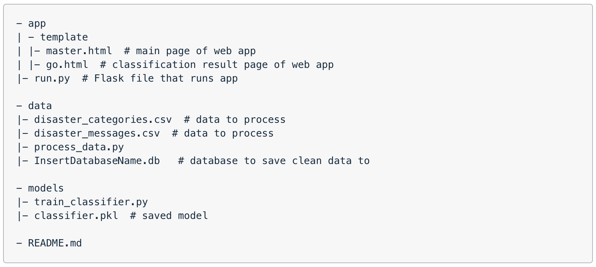

# Disaster Response Pipeline

## Project Overview
The main objective of the project was to analyze disaster data from [Figure Eight](https://www.figure-eight.com/) to build a model for an API that classifies disaster messages.

This project was completed as part of Udacity's [Data Scientist Nanodegree](https://eu.udacity.com/course/data-scientist-nanodegree--nd025) certification.

## Files in the Repository

## Instructions:
1. Run the following commands in the project's root directory to set up your database and model.

    - To run ETL pipeline that cleans data and stores in database
        `python data/process_data.py data/disaster_messages.csv data/disaster_categories.csv data/DisasterResponse.db`
    - To run ML pipeline that trains classifier and saves
        `python models/train_classifier.py data/DisasterResponse.db models/classifier.pkl`

2. Run the following command in the app's directory to run your web app.
    `python run.py`

3. Go to http://0.0.0.0:3001/

## Results
ETL (Extract Transfer Load) and ML (Machine Learning) pipelines were created ready for API-like use. Flask web application enhanced with additional visualizations.

## Tools
- Python, Jupyter Lab
- Libraries: pandas, re, sqlalchemy, ntlk, sklearn, pickle, sys, flask, plotly, sqlite3